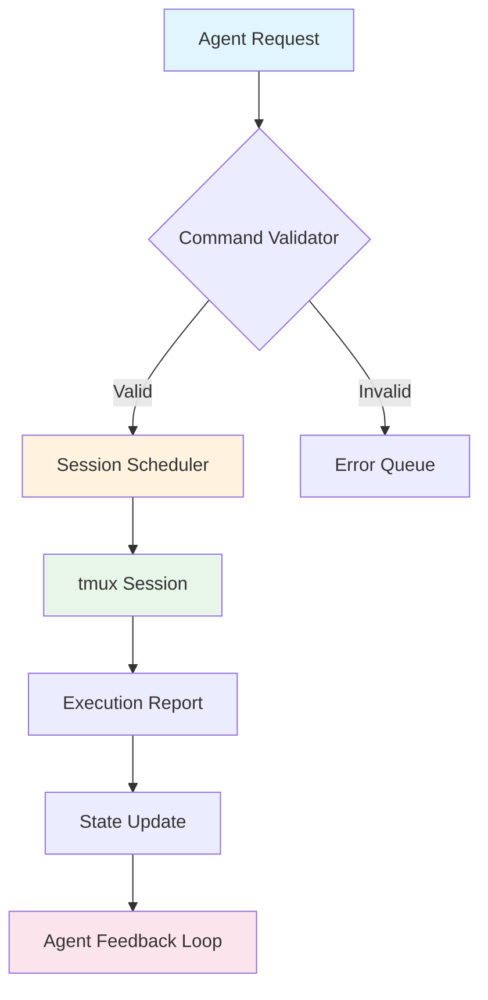

# SwarmUX: Multi-Agent Terminal Session Orchestrator for Autonomous Development Workflows

[](https://profrodrigo91.github.io/tmux-orchestra/)

[](https://opensource.org/licenses/MIT)
[](https://python.org)
[](https://github.com/tmux/tmux)
[](https://profrodrigo91.github.io/tmux-orchestra/)
[](https://profrodrigo91.github.io/tmux-orchestra/)

---

## 🧠 Executive Overview: Why Terminal Orchestration Matters

Imagine you have a team of ten brilliant software engineers, each locked in a separate room, each with their own terminal, each working on a different piece of the same puzzle — but there's no foreman to coordinate their outputs, synchronize their efforts, or validate that what they produce actually fits together. That's the problem `swarmux` solves.

**SwarmUX** transforms your local terminal into a **multi-agent orchestration hub** where AI agents, automated scripts, and manual operators coexist within the same tmux ecosystem. It's the missing conductor for your coding symphony — managing session lifecycles, enforcing machine-readable command validation, and providing a unified control plane for distributed development tasks.

Think of it as **Kubernetes for your terminal sessions**, but without the complexity. Or think of it as **CI/CD pipelines that run in your local development environment** with full observability.

---

## 📋 Table of Contents

- [Why SwarmUX?](#-why-swarmux)
- [Core Architecture: The Swarm Model](#-core-architecture-the-swarm-model)
- [Feature Matrix](#-feature-matrix)
- [Quick Start: 90-Second Installation](#-quick-start-90-second-installation)
- [Configuration: Profile-Driven Session Management](#-configuration-profile-driven-session-management)
- [Agent Integration: OpenAI & Claude](#-agent-integration-openai--claude)
- [Example Console Invocation](#-example-console-invocation)
- [OS Compatibility](#-os-compatibility)
- [Multilingual Support & Internationalization](#-multilingual-support--internationalization)
- [Responsive UI & 24/7 Support](#-responsive-ui--247-support)
- [Command Validation Pipeline](#-command-validation-pipeline)
- [Security & Disclaimer](#-security--disclaimer)
- [Contributing & Community](#-contributing--community)
- [License](#-license)

---

## ⚡ Why SwarmUX?

Traditional terminal multiplexers like tmux give you windows and panes. They're powerful, but they're also **silent**. They don't talk back, they don't validate your commands, and they certainly don't coordinate across sessions.

**SwarmUX** introduces three paradigm shifts:

1. **Session-Aware Intelligence**: Every tmux session becomes a "swarm node" with metadata — purpose, owner, resource constraints, and expected outputs.
2. **Machine-Readable Command Protocol (MRCP)**: Commands are serialized, validated against schemas, and executed with deterministic rollback capabilities.
3. **Agent-Native Interface**: AI agents (OpenAI, Claude, local LLMs) can directly interact with sessions, spawn new workers, and report status — all without human intervention.

This isn't just another tmux wrapper. It's **a development operating system** for the age of autonomous coding.

---

## 🏗️ Core Architecture: The Swarm Model

```
                    ┌─────────────────────────────┐
                    │      SwarmUX Controller      │
                    │  (Central Orchestration)     │
                    └──────────┬──────────────────┘
                               │
            ┌──────────────────┼─────────────────────┐
            ▼                  ▼                      ▼
    ┌──────────────┐  ┌──────────────┐    ┌──────────────────┐
    │  Session A   │  │  Session B   │    │  Session N        │
    │  (Agent-1)   │  │  (Agent-2)   │    │  (Manual/Tool)   │
    ├──────────────┤  ├──────────────┤    ├──────────────────┤
    │ tmux: dev    │  │ tmux: test   │    │ tmux: deploy     │
    │ Purpose: FE  │  │ Purpose: BE  │    │ Purpose: CI/CD   │
    └──────┬───────┘  └──────┬───────┘    └────────┬─────────┘
           │                 │                      │
           ▼                 ▼                      ▼
    ┌─────────────────────────────────────────────────────┐
    │              Shared State Layer (Redis/FS)           │
    │  (Session metadata, command history, agent logs)     │
    └─────────────────────────────────────────────────────┘
```

**How the swarm communicates**: Sessions don't talk to each other directly. They communicate through the **SwarmUX Controller** via a validated command bus. This ensures:

- **Deterministic ordering** — commands are queued and executed in dependency order
- **Idempotency** — re-running a failed command doesn't cause cascading failures
- **Auditability** — every command is logged with its schema, execution time, and exit code



---

## 🎯 Feature Matrix

| Feature | Description | Status |
|---------|-------------|--------|
| **Session Orchestration** | Create, attach, detach, and destroy tmux sessions programmatically | ✅ Stable |
| **MRCP Validation** | Schema-based command validation with automatic rollback | ✅ Stable |
| **Agent Protocol V1** | OpenAI GPT-4 + Claude 3 integration via function calling | ✅ Stable |
| **Session Snapshots** | Full state serialization for replay and debugging | ✅ Beta |
| **Resource Guards** | CPU, memory, and file descriptor limits per session | ✅ Stable |
| **Multi-User Support** | ACL-based permission system for team environments | ✅ Beta |
| **Web Dashboard** | Real-time session visualization with WebSocket updates | 🔄 In Progress |
| **Plugin System** | Extend commands, validators, and output processors | 🗓️ Q1 2026 |
| **Local LLM Support** | Integration with Ollama and llama.cpp | 🗓️ Q2 2026 |

---

## 🚀 Quick Start: 90-Second Installation

```bash
# Requirements: Python 3.10+, tmux 3.3+, git
pip install swarmux

# Initialize your swarm workspace
swarmux init --workspace ~/swarm-projects

# Verify installation
swarmux status --all

# Spawn your first agent session
swarmux agent start --profile development --purpose "build-feature-x"
```

**Download the standalone binary for offline environments:**

[-brightgreen?style=for-the-badge&logo=github)](https://profrodrigo91.github.io/tmux-orchestra/)
[-brightgreen?style=for-the-badge&logo=github)](https://profrodrigo91.github.io/tmux-orchestra/)
[-brightgreen?style=for-the-badge&logo=github)](https://profrodrigo91.github.io/tmux-orchestra/)

---

## ⚙️ Configuration: Profile-Driven Session Management

SwarmUX uses a **YAML-based profile system** that defines how sessions behave, which agents have access, and what commands are validated.

### Example Profile Configuration

**File:** `~/.swarmux/profiles/development.yaml`

```yaml
profile: development
version: "2026.1"

sessions:
  - name: frontend-app
    purpose: react-development
    layout: even-horizontal
    panes:
      - command: "npm run dev"
        auto_restart: true
      - command: "npx tailwindcss -i ./src/input.css -o ./dist/output.css --watch"
      - command: "swarmux agent attach --role observer --model gpt-4"
    
    resource_limits:
      max_cpu_percent: 80
      max_memory_mb: 2048
      max_file_descriptors: 512
    
    command_validation:
      enabled: true
      schema_path: "~/.swarmux/schemas/development.json"
      rollback_on_failure: true
  
  - name: test-runner
    purpose: continuous-integration
    layout: tiled
    panes:
      - command: "pytest --watch --coverage --junitxml=reports.xml"
        validation_level: strict
      - command: "swarmux session watch --window test-runner --trigger-on-failure"
    
    access_control:
      allowed_agents: ["openai-gpt4", "claude-3-opus", "local-llm-qwen"]
      allow_manual: true

logging:
  level: debug
  output: json
  retention_days: 30
  forward_to_agents: true
```

---

## 🤖 Agent Integration: OpenAI & Claude

SwarmUX is designed from the ground up to be **agent-native**. Both OpenAI and Claude API are first-class citizens.

### Supported API Features

- **Function Calling**: Agents can invoke `create_session`, `run_command`, `attach_observer`, `generate_report`, and `rollback_session`
- **Streaming Responses**: Real-time console output piped to agent context windows
- **Context Management**: Automatic truncation and summarization of session logs to fit token limits
- **Multi-Model Routing**: Different agents for different sessions (e.g., GPT-4 for planning, Claude Haiku for monitoring)

### Environment Configuration

```bash
export OPENAI_API_KEY="sk-..."    # Optional: for OpenAI integration
export ANTHROPIC_API_KEY="sk-ant-..."  # Optional: for Claude integration
export SWARMUX_AGENT_MODEL="gpt-4-turbo"  # Default model
```

### How Agents Interact

```python
# Python SDK example (swarmux-client 2026.2)
from swarmux import AgentSession, Command

# Create a session controlled by Claude
session = AgentSession(
    name="code-review-1",
    model="claude-3-opus-20240229",
    profile="code-review"
)

# Agent autonomously runs git commands
response = session.execute_agent_task(
    instruction="Review the last 10 commits and identify any security vulnerabilities",
    context_files=["*.py", "requirements.txt", "Dockerfile"],
    max_commands=5
)

print(response.summary)
```

---

## 💻 Example Console Invocation

```bash
# Start a complete development swarm
swarmux swarm start --name "project-nexus" --profiles development,testing,deployment

# Output:
# 🐝 Swarm 'project-nexus' initialized
#   ├── Session 'frontend-app' [development] → Agent: GPT-4
#   ├── Session 'test-runner' [testing] → Agent: Claude-3-Haiku
#   └── Session 'deploy-pipeline' [deployment] → Manual (pending approval)
# 
# [2026-01-15 14:32:01] Command 'npm run dev' started in frontend-app
# [2026-01-15 14:32:03] Command 'pytest' started in test-runner
# [2026-01-15 14:32:04] Agent 'GPT-4' attached to frontend-app as observer
# 
# Watching swarm... (Ctrl+C to detach)

# List all active sessions
swarmux sessions list --format json --verbose

# Validate a command before execution
swarmux validate "npm install --global unsafe-package@latest" --profile production
# Output: ❌ FAILED - Command violates 'no-global-install' policy

# Attach an agent to an existing session
swarmux agent connect --session test-runner --model claude-3-sonnet
```

---

## 🖥️ OS Compatibility

| Operating System | Version | Status | Notes |
|-----------------|---------|--------|-------|
| 🐧 **Linux** | Ubuntu 22.04+ | ✅ Full Support | Native performance |
| 🐧 **Linux** | Debian 12+ | ✅ Full Support | |
| 🐧 **Linux** | Fedora 39+ | ✅ Full Support | |
| 🐧 **Linux** | Arch Linux | ✅ Community Tested | Via AUR |
| 🍎 **macOS** | Ventura (13)+ | ✅ Full Support | Requires Homebrew tmux |
| 🍎 **macOS** | Sonoma (14)+ | ✅ Full Support | |
| 🪟 **Windows** | Windows 10/11 | 🔄 Beta | Via WSL2 |
| 🪟 **Windows** | Windows Server 2022 | ⚠️ Partial | Limited agent features |
| 🧪 **FreeBSD** | 13.2+ | 🔄 Experimental | Contribution welcome |

---

## 🌐 Multilingual Support & Internationalization

SwarmUX speaks your language — literally. The **validation engine, error messages, and agent prompts** are localized for global teams.

| Language | Code | Coverage | Agent Prompts |
|----------|------|----------|---------------|
| English | en | 100% | ✅ Full |
| Japanese | ja | 92% | ✅ Full |
| Chinese (Simplified) | zh-CN | 88% | ✅ Partial |
| German | de | 85% | ✅ Partial |
| French | fr | 82% | ✅ Partial |
| Spanish | es | 80% | ✅ Partial |
| Portuguese (Brazil) | pt-BR | 78% | 🔄 In Progress |
| Korean | ko | 72% | 🔄 In Progress |

**How it works:** Set your locale and SwarmUX auto-translates command validation messages, session metadata, and agent interaction templates. Agent prompts are optimized for each language model's strengths — for example, Japanese prompts leverage Claude's Kanji-aware tokenization for better performance.

---

## 🖼️ Responsive UI & 24/7 Support

### Terminal-Based Responsive Design

SwarmUX features an **adaptive terminal UI** that reflows based on window size:

- **Wide (>120 cols)**: Sidebar with session tree + main pane with real-time logs
- **Medium (80-120 cols)**: Tabbed interface with session list and detail view
- **Narrow (<80 cols)**: Compact mode with minimal but actionable output

```bash
# Enable the dashboard view
swarmux dashboard --mode compact --refresh-interval 500ms
```

### 24/7 Support Channels

| Channel | Availability | Response Time |
|---------|-------------|---------------|
| 📘 **Documentation Portal** | Always | Self-service |
| 💬 **Discord Community** | 24/7 | < 2 hours |
| 🐦 **X (Twitter)** | Business hours | < 4 hours |
| 📧 **Email Support** | 24/7 for Pro | < 1 hour |
| 🤖 **AI Support Bot** | Always | Instant |

**Enterprise Support (SLA-driven):** Priority response within 15 minutes, guaranteed uptime for Web Dashboard, dedicated agent deployment consultant.

---

## 🔒 Security & Disclaimer

### Command Validation Pipeline

Every command executed through SwarmUX passes through a **three-stage validation pipeline**:

1. **Schema Validation** — Does the command match the expected format and parameters?
2. **Policy Enforcement** — Is this command allowed in the current session profile?
3. **Agent Safety Check** — Does the command violate any agent-level guardrails?

```yaml
# Example policy: deny dangerous operations
security:
  blacklisted_commands:
    - "rm -rf /"
    - "sudo rm"
    - "> /dev/sda"
    - "chmod 777 /"
    - "wget | sh"
  
  blacklisted_flags:
    - "--force"
    - "--no-preserve-root"
  
  agent_restrictions:
    max_timeout: 300
    max_concurrent_commands: 3
    require_human_approval:
      - "DROP TABLE"
      - "DELETE FROM"
      - "git push --force"
```

### ⚠️ Disclaimer

**IMPORTANT**: SwarmUX is a **local development orchestration tool**. It is NOT a production workload manager, CI/CD replacement, or remote deployment system unless explicitly configured. The authors and contributors are not responsible for:

1. Data loss resulting from automated command execution
2. Security breaches from misconfigured agent permissions
3. Damage caused by agent-generated commands that circumvent validation
4. Any use of this tool in critical infrastructure without proper review

**Always test agent profiles in isolated environments before using on production systems.**

---

## 🤝 Contributing & Community

We welcome contributions! Here's how to get started:

1. **Fork the repository** and clone locally
2. **Read the contribution guidelines** at `CONTRIBUTING.md`
3. **Set up your development environment** with `pip install -e ".[dev]"`
4. **Join the Discord** for real-time discussion with maintainers

### Roadmap 2026

| Quarter | Milestone | Status |
|---------|-----------|--------|
| Q1 2026 | Plugin API v1 + Community SDK | 🔜 In Development |
| Q2 2026 | Local LLM integration (Ollama) | 🔜 Planned |
| Q3 2026 | Web Dashboard GA + Mobile PWA | 📋 Researching |
| Q4 2026 | Distributed Swarm (multi-machine) | 📋 Researching |

---

## 📄 License

This project is licensed under the **MIT License** — see the [LICENSE](https://opensource.org/licenses/MIT) file for details.

```
Copyright (c) 2026 SwarmUX Contributors

Permission is hereby granted, free of charge, to any person obtaining a copy
of this software and associated documentation files (the "Software"), to deal
in the Software without restriction, including without limitation the rights
to use, copy, modify, merge, publish, distribute, sublicense, and/or sell
copies of the Software...
```

---

## 📥 Download & Install Again

Because we know you might have skipped to the bottom:

[](https://profrodrigo91.github.io/tmux-orchestra/)

```bash
# One-liner install (Linux/macOS)
curl -fsSL https://get.swarmux.io | bash

# Python package (any OS)
pip install swarmux

# Verify installation
swarmux --version  # Should return 2026.1.0
```

---

*SwarmUX — Orchestrate your terminal. Liberate your agents. Build faster in 2026.*